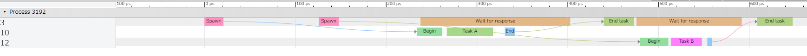

# rust-trace-event-profiler
Capture profile data to the [Trace Event Format](https://github.com/catapult-project/catapult/tree/master/tracing).

## How it works

```rust
let mut profiler = Profiler::new();
profiler.begin_duration("Task A");
{
    profiler.begin_and_end_duration("Task B", run_dummy_task);
    profiler.begin_and_end_duration("Task C", run_dummy_task);
}
profiler.end_duration();

profiler.save_file("simple.json");
```

simple.json in chrome://traing


---

```rust
let sync_profiler = Arc::new(Mutex::new(Profiler::new()));

let main_thread_profiler = Profiler::new();
let mut mtp = main_thread_profiler;

let (sender, receiver) = channel();
for task_name in vec!["Task A", "Task B"] {
    let flow_id = mtp.begin_flow("Spawn", "main_to_spawn");

    let sender = sender.clone();
    let sync_profiler = sync_profiler.clone();
    let profiler = mtp.clone();

    thread::spawn(move || {
        let mut profiler = profiler;
        profiler.clear();

        profiler.end_flow("Begin", "main_to_spawn", flow_id);
        profiler.begin_and_end_duration(task_name, run_dummy_task);

        let flow_id = profiler.begin_flow("End", "spwan_to_main");

        sender.send(flow_id).unwrap();
        sync_profiler.lock().unwrap().extend(profiler);
    });
}

for _ in 0..2 {
    let flow_id =
        mtp.begin_and_end_duration("Wait for response", || receiver.recv().unwrap());

    mtp.end_flow("End task", "spwan_to_main", flow_id);
}

let sync_profiler = sync_profiler.clone();
sync_profiler.lock().unwrap().extend(mtp);
sync_profiler.lock().unwrap().save_file("flow.json");
```

flow.json in chrome://traing
